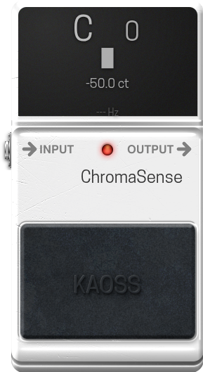

# ChromaSense – LV2 Chromatic Tuner

**A high-precision, low-latency chromatic tuner LV2 plugin, optimized for the MOD Audio platform.**

This plugin is a direct port and enhancement of the Guitarix [`gxtuner`](https://github.com/brummer10/gxtuner) project, repackaged as a modern LV2 plugin with a MODGUI for usage with the MOD Audio platform.

<p align="center">
  
</p>

---

## Features

*   **LV2 Plugin Format:** Designed to integrate seamlessly with MOD Audio devices platform.
*   **Custom MODGUI:** A clean user interface featuring:
    *   A large, clear display for the detected note and octave.
    *   A precise cents (`ct`) readout.
    *   A sliding triple-block meter (`███`) that provides intuitive visual feedback for fine-tuning, glowing green when the note is within a ±2 cent range.

---

## Installation

For most users, it is recommended to download the pre-built plugin from the **[Releases Page](https://github.com/theKAOSSphere/chromasense/releases)**.

1.  Go to the [Releases Page](https://github.com/theKAOSSphere/chromasense/releases).
2.  Download the latest `chromasense.lv2-vx.x.tgz` file.
3.  Unzip the file. You will have a folder named `chromasense.lv2`.

### For MOD Audio Devices

1.  **Transfer the Plugin:** Copy the entire `chromasense.lv2` directory from your computer to your MOD Audio device. You can use `scp` for this:
    ```bash
    # Example command from your Downloads folder
    scp -r ~/Downloads/chromasense.lv2 root@192.168.51.1:/data/plugins/
    ```
2.  **Restart the Host:** Connect to your device via `ssh` and restart the `mod-host` service:
    ```bash
    ssh root@192.168.51.1
    systemctl restart mod-host
    ```
3.  **Refresh the Web UI:** Reload the MOD web interface in your browser. ChromaSense Tuner should now be available.

### For Linux Desktops

1.  **Copy the LV2 Bundle:** Copy the `chromasense.lv2` folder to your user's LV2 directory.
    ```bash
    cp -r ~/Downloads/chromasense.lv2 /path/to/lv2/directory/
    ```
2.  **Scan for Plugins:** Your LV2 host (e.g., Ardour, Carla) should automatically detect the new plugin on its next scan.

---

## Building From Source

<details>
<summary><strong>► Build for MOD Audio Devices (using mod-plugin-builder)</strong></summary>

This project is configured to be built using the **`mod-plugin-builder`** toolchain. For more details on setting up the MOD Plugin Builder, please refer to the [mod-plugin-builder](https://github.com/mod-audio/mod-plugin-builder) repository.

#### Prerequisites

1.  A functional **MOD Plugin Builder** environment.
2.  The necessary build dependencies (`libfftw3`) are handled by the buildroot environment.

#### Build Steps

1.  **Clone the Repository:**
    Place the `chromasense` repository inside the `plugins/package` directory of your `mod-plugin-builder` folder.
    ```bash
    cd /path/to/mod-plugin-builder/plugins/package
    git clone https://github.com/theKAOSSphere/chromasense
    ```
2.  **Run the Build:**
    Navigate to the root of the `mod-plugin-builder` and run the build command, targeting `chromasense`.
    ```bash
    cd /path/to/mod-plugin-builder
    ./build <target> chromasense
    ```
    Replace `<target>` with your device target (e.g., `modduox-new`). The compiled bundle will be located in the `/path/to/mod-workdir/<target>/target/usr/local/lib/lv2` directory. You can then follow the installation instructions to transfer it to your device.

</details>

<details>
<summary><strong>► Build for Linux Desktop (Standalone)</strong></summary>

For testing on a standard Linux desktop without the MOD toolchain.

### Prerequisites

You must have the necessary development libraries installed. On a Debian-based system (like Ubuntu), you can install them with:
```bash
sudo apt-get update
sudo apt-get install build-essential libfftw3-dev lv2-dev
```

### Build Steps

1.  **Navigate to the Source Directory:**
    ```bash
    cd source/
    ```
2.  **Compile the Plugin:**
    ```bash
    make
    ```
    A `chromasense.lv2` bundle will be created inside the `source/` directory. You can then follow the desktop installation instructions to copy it to `/path/to/lv2/directory/`.

</details>

---

## Credits and License

*   **Original Algorithm:** This project is heavily based on the [`gxtuner`](https://github.com/brummer10/gxtuner) application by **Hermann Meyer (brummer10)**. All credit for the core pitch-detection logic goes to him.
*   **zita-resampler:** The resampling functionality is provided by the [`zita-resampler`](https://kokkinizita.linuxaudio.org/linuxaudio/zita-resampler/resampler.html) library, created by **Fons Adriaensen**.
*   **LV2 Port & MODGUI:** Porting to the LV2 format and development of the MODGUI by **KAOSS**.

This project is licensed under the GPLv3 license. Please see the [`LICENSE`](LICENSE) file for more details.